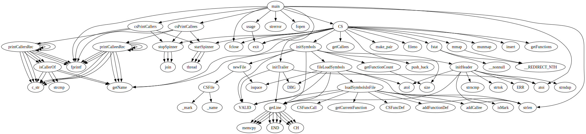

# Function call graph

Generates a graphviz output file (.dot) for a given function. The output displays the callers and/or callees of the specified function.

# Dependencies

- To create a cscope database you will need [cscope](http://cscope.sourceforge.net/)
- To generate a graph from the output of function call graph, you will need [graphviz](http://www.graphviz.org/)

# Build and install

```sh
./build.sh
sudo cp ./function_call_graph /usr/bin/
```

# Run

To build a cscope database run cscope with the `-b` option. Also, function call graph does not support compressed cscope databases, so specify `-c` when building the cscope database, for example:

```sh
cscope -cb *.c
```

This command will search all `.c` files in your current working directory and produce a `cscope.out` which is the cscope database that function call graph takes as input.

To convert the cscope database into a `.dot` file, run:

```sh
function_call_graph FUNCTION_NAME i cscope.out o graph.dot
```

To convert the `.dot` file into an image, run:

```sh
dot graph.dot -Tpng -o graph.png
```

# Attribution

- Forked from [fnplot](https://github.com/enferex/fnplot)
- The cscope parsing functionality originated from [coogle](https://github.com/enferex/coogle) which is another one of [enferex's](https://github.com/enferex) projects
